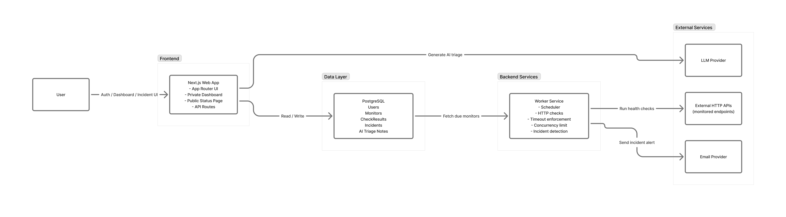

# API Sentinel

AI-powered API monitoring and incident triage tool.

API Sentinel monitors HTTP endpoints, detects failures or latency anomalies, and helps engineers quickly understand incidents through automated diagnostics and AI-generated summaries.

This project is designed as a **production-style portfolio project** demonstrating monitoring architecture, background workers, and observability concepts.

---

## System Architecture



---

## Project Goal

API Sentinel is being built to demonstrate the design and implementation of a production-style monitoring system, including:

- API health monitoring
- background worker architecture
- failure detection and incident tracking
- observability concepts
- AI-assisted incident triage

---

## Implementation Status

### ✅ Completed

#### Authentication

- Email + password registration and login (Better Auth)
- Server-side session validation on every protected route
- Session listing with device/IP/date info
- Per-session revoke and bulk "sign out other sessions"
- Smart root redirect — authenticated users land on `/dashboard`, guests on `/login`

#### Dashboard Shell

- Protected dashboard layout with server-side session guard
- Collapsible sidebar with smooth width transition
  - Active nav item left-border indicator
  - User avatar, name, and plan label in the footer
  - Dropdown with Profile and Sign out actions
- Slim top bar showing current page title and theme toggle
- Light / dark mode via `next-themes`

#### Pages

- **Dashboard home** — personalised greeting, 3 stat preview cards (Monitors, Avg Uptime, Incidents), and an empty state for when no monitors are configured
- **Profile** — avatar header card showing name, email (verified badge), role, plan, and member since date
- **Sessions** — active session list with device icons, IP, signed-in date, expiry date, and revoke controls

### ⏳ Planned / In Progress

- Monitor creation and management
- Background worker for HTTP health checks
- Incident detection and tracking
- AI-generated incident triage summaries
- Public status page

---

## Features

- Monitor HTTP/HTTPS endpoints
- Detect downtime and unexpected status codes
- Track response latency
- Persist historical check results
- Incident detection and tracking
- AI-generated incident triage summaries
- Public status page for monitored services

---

## Tech Stack

| Layer         | Technology                                                        |
| ------------- | ----------------------------------------------------------------- |
| Framework     | Next.js 16 (App Router)                                           |
| Language      | TypeScript                                                        |
| Auth          | Better Auth 1.5                                                   |
| Database      | PostgreSQL (Neon)                                                 |
| ORM           | Prisma 7 + `@prisma/adapter-pg`                                   |
| Styling       | Tailwind CSS v4 (oklch colour system)                             |
| UI Components | shadcn/ui (button, input, badge, avatar, skeleton, tooltip, card) |
| Icons         | Lucide React                                                      |
| Theme         | next-themes                                                       |
| AI (planned)  | LLM provider for incident summaries                               |

---

## Project Structure

```
src/
├── app/
│   ├── (auth)/           # Login + register pages
│   ├── dashboard/
│   │   ├── layout.tsx    # Protected shell — session guard + sidebar/topbar
│   │   ├── page.tsx      # Dashboard home with stat cards
│   │   ├── profile/      # User profile page
│   │   └── sessions/     # Active session management
│   └── page.tsx          # Root redirect (dashboard or login)
├── components/
│   ├── dashboard/
│   │   ├── Sidebar.tsx   # Collapsible nav + user footer dropdown
│   │   └── TopBar.tsx    # Page title + theme toggle
│   ├── shared/           # ThemeToggle, ThemeProvider
│   └── ui/               # shadcn components
└── lib/
    ├── auth.ts           # Better Auth server config
    ├── auth-client.ts    # Better Auth client
    └── prisma.ts         # Prisma singleton with pg adapter
```

---

## Running the Project

Install dependencies

```bash
npm install
```

## Run Database Migration

```bash
npx prisma migrate dev
```

## Start the development server

```bash
npm run dev
```
