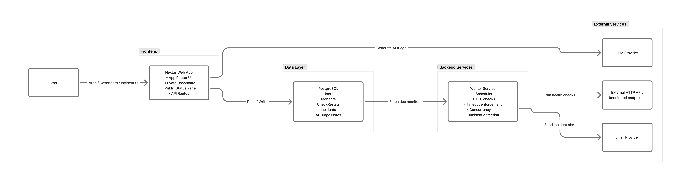

# API Sentinel

**API monitoring with automated incident detection, AI-assisted triage, and email alerting.**

API Sentinel continuously monitors HTTP endpoints, detects failures and latency degradation through consecutive-streak analysis, opens and closes incidents automatically, and generates AI-powered root-cause triage to help engineers diagnose issues faster. It includes shareable public status pages and email alerting on incident open/close.

🔗 **Live:** [apisentinelhq.vercel.app](https://apisentinelhq.vercel.app)

---

## System Architecture



A Vercel Cron job triggers a worker every minute. The worker fans out concurrency-limited health checks, each running as an isolated Prisma transaction that persists the result and manages the incident lifecycle atomically. Incident open/close events surface out of the transaction and trigger email alerts post-commit, so a slow or failing email provider can never roll back a recorded incident.

---

## Features

- **Endpoint monitoring** — HTTP/HTTPS checks on a configurable per-monitor interval, with timeout, expected-status, and latency-threshold settings
- **Smart incident detection** — FAILURE incidents open only after 3 consecutive failures; LATENCY incidents require 2 consecutive slow responses plus a 10-check baseline, and close only after 2 consecutive recoveries (anti-flapping)
- **AI triage** — one-click Gemini-generated root cause, likely change, and debug steps per incident, grounded strictly in the check evidence; written once and locked (no regeneration drift)
- **Email alerts** — Resend-powered notifications to the monitor owner when an incident opens or resolves, sent from both the cron worker and manual checks
- **Public status page** — shareable `/status/{slug}` URL showing live status, 24 h uptime, and recent incident history; no auth required
- **Dashboard** — per-monitor uptime %, latency charts, check history, and open-incident tracking
- **Background worker** — Vercel Cron every minute, concurrency-limited fan-out (`p-limit`), per-check isolation, and an atomic `nextCheckAt` race guard against overlapping cron invocations

---

## Tech Stack

| Layer | Choice |
|---|---|
| Framework | Next.js 16 (App Router, Server Actions) |
| Database | PostgreSQL (Neon) + Prisma 7 (`@prisma/adapter-pg`) |
| Auth | Better Auth — email/password + GitHub & Google OAuth |
| AI | Google Gemini (`gemini-3.1-flash-lite`) via `@google/genai`, JSON-schema-enforced output |
| Email | Resend + React Email |
| UI | Tailwind CSS v4 (OKLch), shadcn/ui, Recharts |
| Scheduling | Vercel Cron |

---

## Engineering Highlights

- **Transaction-safe alerting** — incident lifecycle mutations run inside a Prisma transaction; email sends happen only after commit, in a best-effort try/catch that never aborts the cron batch.
- **Race-condition guard** — `nextCheckAt` is advanced atomically within the check transaction, preventing two overlapping cron runs from double-checking the same monitor.
- **Anti-flapping incident logic** — consecutive-streak thresholds for both opening and closing incidents prevent alert noise from transient blips.
- **Grounded AI output** — the triage prompt instructs the model to reason only from provided evidence and uses Gemini's schema enforcement so responses always parse into a fixed shape.
- **Defensive rendering** — stored AI triage JSON is parsed defensively so malformed data never crashes the incident page.

---

## Local Development

```bash
npm install
npx prisma migrate dev
npm run dev
```

See [docs/setup.md](docs/setup.md) for environment variables and deployment details.

### Required environment variables

| Variable | Purpose |
|---|---|
| `DATABASE_URL` | PostgreSQL connection string |
| `BETTER_AUTH_SECRET` / `BETTER_AUTH_URL` | Session signing + base URL |
| `GITHUB_CLIENT_ID` / `GITHUB_CLIENT_SECRET` | GitHub OAuth |
| `GOOGLE_CLIENT_ID` / `GOOGLE_CLIENT_SECRET` | Google OAuth |
| `CRON_SECRET` | Bearer token protecting the cron endpoint |
| `GEMINI_API_KEY` | Google Gemini API key for AI triage |
| `RESEND_API_KEY` / `ALERT_FROM_EMAIL` | Email alerting |

---

## Documentation

- [docs/setup.md](docs/setup.md) — environment variables, local dev, migrations, deployment
- [docs/architecture.md](docs/architecture.md) — folder structure, conventions, feature flows
- [docs/decisions.md](docs/decisions.md) — key technical decisions and trade-offs
